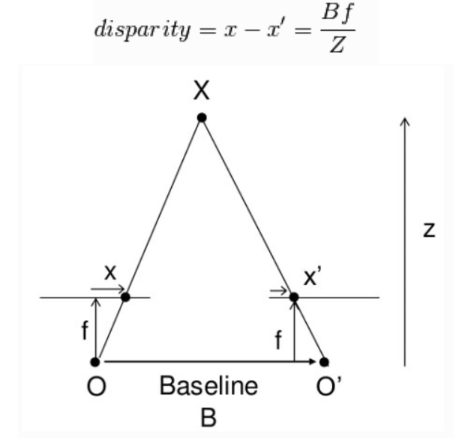
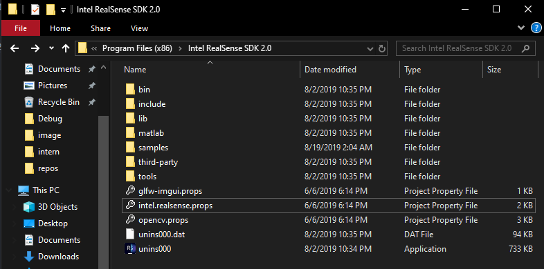

# ĐO KÍCH THƯỚC VẬT THỂ BẰNG STEREO CAMERA

## TỔNG QUAN

Đây là bài viết hướng dãn cách sử dụng stereo camera và ứng dụng của stereo trong ứng dụng thực tế là đo kích thước 3 chiều của một vật thể
cụ thể là đo kích thước hình hộp
Bài hướng dẫn bao gồm 3 phần:
1/ Cách stereo camera tính độ sâu
2/ Cách cài đặt và sử dụng thư viện librealsene2 trên Window và Linux
3/ Giải thuật thực hiện trong ứng dụng đo kích thước hình hộp

## 1/ Cách stereo camera tính độ sâu

Ở phần này, chúng ta sẽ tìm hiểu xem stereo camera là gì và cách để nó có thể tính độ sâu
* Stereo camera là một hệ thống gồm 2 hoặc nhiều hơn camera kết hợp với nhau, với mục tiêu mô phỏng mắt người để có thể tính độ sâu

* Để tính được độ sâu, ban đầu chúng ta sẽ chiếu điểm cần tính độ sâu xuống 2 mặt phẳng ảnh

Đến đây ta sẽ làm quen với một khái niệm là Disparity

Trong đó:

    - x là khoảng cách của điểm đang xét trên mặt phẳng ảnh 1 đến trung tâm của bức ảnh theo trục hoành
    - x' là khoảng cách của điểm đang xét trên mặt phẳng ảnh 2 đến trung tâm của bức ảnh theo trục hoành
    - f là tiêu cự của stereo camera
    - B (Baseline) là khoảng cách giữa 2 tâm cảm biến của 2 camera trong hệ thống stereo camera
    - Z chính là khoảng cách từ stereo camera đến điểm cần được tính độ sâu

Đến đây chúng ta đã nắm được cách stereo tính độ sâu, tiếp theo chúng ta sẽ làm quen với thư viện librealsense2

## 2/ Cách cài đặt và sử dụng thư viện librealsene2 trên Window và Linux

Ở bài hướng dẫn này sẽ sử dụng stereo depth camera Intel Realsense D415

Stereo Depth Camera D415 là một stereo camera của hãng Intel, Intel cung cấp cho chúng ta một gói thư viện SDK bao gồm rất nhiều ví dụ kèm code mẫu, wrapper cho python, c#,...

[Intel® RealSense™ SDK 2.0](https://github.com/IntelRealSense/librealsense)

Thư viện này có thể hoạt động trên 3 hệ điều hành phổ biến nhất hiện nay là Window, Linux và MacOs

Hướng dẫn cài đặt: [Installation](https://github.com/IntelRealSense/librealsense/blob/master/doc/installation.md)

* Cách cài đặt và sử dụng trên Window

Để có thể cài đặt thư viện trên window, chúng ta làm theo các bước sau:

Cài đặt ô được khoanh đỏ để tải thư viện và ứng để giao tiếp với D415: [Intel.RealSense.Viewer.exe](https://github.com/IntelRealSense/librealsense/releases)

Sau khi tải xuống máy xong, ta nhấn file vừa tải xuống để tiến hành cài đặt. Quá trình cài đặt rất đơn giản, chúng ta chỉ cần nhấn "Next" và cuối cùng nhấn "Install" để tiến hành cài.
Sau khi cài xong thư viện và phần mềm sẽ được lưu trong "C:\Program Files (x86)\Intel RealSense SDK 2.0"

Để xác nhận việc cài đặt đã thành công, chúng ta mở ứng dụng Intel Realsense Viewer và cắm D415 vào máy tính để kiểm tra máy có kết nối thành công hay không

Phần mềm dùng để chạy code mẫu và lập trình được sử dụng trong bài hướng dẫn này là [Visual Studio Community 2017](https://docs.microsoft.com/vi-vn/visualstudio/releasenotes/vs2017-relnotes)

Thư viện librealsense2 cung cấp cho ta sẵn các project mẫu để chạy trên Visual Studio, nên chúng ta chỉ cần vào đường dẫn sau để mở và chạy thử: "C:\Program Files (x86)\Intel RealSense SDK 2.0\samples"

Để sử dụng thư viện librealsense2 trên phần mềm Visual Studio này thì chúng ta phải add thư viện này vào project của chúng ta, việc add được thực hiện đơn giản như sau:

    - Bước 1: Mở View -> Other Windows -> Property Manager
    - Bước 2: Chọn vào thẻ Property Manager và chọn Project cần add thư viện
    - Bước 3: Nhấn vào Add Existing Property Sheet (Một cửa sổ sẽ hiện lên để chúng ta chọn file property)

    
    - Bước 4: Đi đến đường dẫn "C:\Program Files (x86)\Intel RealSense SDK 2.0" rồi chọn file "intel.realsense.props" để hoàn thành add thư viện librealsense2

Một lưu ý khi sử dụng thư viện librealsense2 đó là bạn phải build và chạy project ở chế độ 64 bit (x64)

* Cách cài đặt và sử dụng trên Linux

Cài đặt trên hệ điều hành Linux phức tạp hơn một chút so với cài trên Window
Hướng dẫn cài đặt: [Linux Installation](https://github.com/IntelRealSense/librealsense/blob/master/doc/distribution_linux.md)

Sau khi cài đặt xong theo hướng dẫn trên, mở Commad Line và gõ dòng lệnh sau mở ứng dụng Realsense Viewer để kiểm tra cài đặt: 

    realsense-viewer

Sau khi chương trình khởi động sau, có thể chương trình sẽ báo lỗi sau

Đây là lỗi khi chương trình của bạn có 2 file realsense-udev, vì thể chúng ta cần xóa đi một cái, ở đây chúng ta sẽ xóa file: 99-realsense-libusb.rules

Mở Command Line mới và đi vào đường dẫn như trong thông báo lỗi của chương trình:

    cd /etc/udev/rules.d      //đi đến đường dẫn chứa file cần xóa
    sudo rm -rf 99-realsense-libusb.rules      //xóa file 

Sau đó chúng ta tắt chương trình cũ đi và mở lại, lỗi sẽ không hiện ra nữa và việc kết nối với Stereo Camera D415 thành công

Để biên dịch chương trình với thư viện librealsense2 bằng Command Line của Linux ta làm theo cú pháp sau: 

    g++ -std=c++11 filename.cpp -lrealsense2    

Chúng ta cần chú ý là thư viện này chạy c++11 nên thiếu điều kiện này code khi build sẽ bị lỗi

Ví dụ mẫu của thư viện librealsense2 sử dụng thư viện glfw để render, nên ta phải thêm thư viện khi build code:

    g++ -std=c++11 filename.cpp -lrealsense2 -lglfw -lGLU -lGL

Có thể khi chạy máy sẽ báo lỗi "DSO missing from command line", khi ấy ta thêm như sau:

    g++ -std=c++11 filename.cpp  -pthread -lrealsense2 -lglfw -lGLU -lGL

Còn nếu muốn build code bằng thư viện Opencv thì ta làm như sau:

    g++ -std=c++11 filename.cpp  -pthread -lrealsense2 `pkg-config --cflags --libs opencv`

Tất nhiên muốn sử dụng thư viện Opencv thì ta phải cài vào máy rồi nhé, cách cài thì có thể làm theo bài hướng dẫn sau: [Opencv Installation](https://www.pyimagesearch.com/2016/10/24/ubuntu-16-04-how-to-install-opencv/)

## 3/ Giải thuật thực hiện trong ứng dụng đo kích thước hình hộp

* Tổng quan về ứng dụng:

Mục tiêu: tạo ra một ứng dụng có thể đo kích thước của vật thể hình hộp đặc trên một mặt phẳng và một giao diện điều khiển trực quan để có thể theo dõi kết quả.

Ứng dụng được xây dựng với 2 chức năng đo kích thước tự động (Auto mode) và đo bằng tay (Manual mode)

Source code ứng dụng đo kích thước vật được chia thành 2 phần xử lí đầu vào (background thread) và phần chạy chính (main thread)

Trước khi chúng ta sử dụng depth map thì chúng ta cần xử lí đầu vào để được độ chính xác cao nhất, việc xử lí này sẽ làm chậm quá trình chạy nên ta đưa việc này vào Background thread, khi nào xử lí xong thì nó ms đẩy ra đầu vào đã được xử lí

Ở đây chúng ta sử dụng câu lệnh "poll_for_frames", nghĩa là main thread luôn chạy mặc dù background đang xử lí, vì nếu background thread chưa xử lí xong thì main thread sẽ lấy đầu vào đã được xử lí rồi cũ, đến khi nào cái mới có thì mới cập nhật lấy cái mới.

 "poll_for_frames" giống như là tạo một hàng đợi, nếu tôi đang xủ lí thì ông lấy cái cũ xài tạm đi, xong rồi thì tôi mới cấp cái mới cho ông xài

 Điều này giúp chương trình luôn chạy ổn định và không phải chờ ai cả :)) 

 ### Running Processing on a Background Thread

    while (alive)
    {
        // Fetch frames from the pipeline and send them for processing
        rs2::frameset fs;
        if (pipe.poll_for_frames(&fs)) 
        {
            // Apply post processing
            // ...
            
            // Send resulting frames for visualization in the main thread
            postprocessed_frames.enqueue(data);
        }
    }

### Converting between pixels and points in 3D

    float dist_3d(const rs2_intrinsics& intr, const rs2::depth_frame& frame, pixel u, pixel v)
    {
        float upixel[2]; // From pixel
        float upoint[3]; // From point (in 3D)

        float vpixel[2]; // To pixel
        float vpoint[3]; // To point (in 3D)

        // Copy pixels into the arrays (to match rsutil signatures)
        upixel[0] = u.first;
        upixel[1] = u.second;
        vpixel[0] = v.first;
        vpixel[1] = v.second;

        // Query the frame for distance
        // Note: this can be optimized
        // It is not recommended to issue an API call for each pixel
        // (since the compiler can't inline these)
        // However, in this example it is not one of the bottlenecks
        auto udist = frame.get_distance(upixel[0], upixel[1]);
        auto vdist = frame.get_distance(vpixel[0], vpixel[1]);

        // Deproject from pixel to point in 3D
        rs2_deproject_pixel_to_point(upoint, &intr, upixel, udist);
        rs2_deproject_pixel_to_point(vpoint, &intr, vpixel, vdist);

        // Calculate euclidean distance between the two points
        return sqrt(pow(upoint[0] - vpoint[0], 2) +
                    pow(upoint[1] - vpoint[1], 2) +
                    pow(upoint[2] - vpoint[2], 2));
    }

Bên trên mình đã giới thiệu một số hàm quan trọng trong source code này, đó là đổi từ điểm pixel ảnh sáng điểm 3D để tính khoảng cách trong tọa độ thực và cách để cho phần xử lí đầu vào chạy nền

Mình khuyến khích các bạn đọc kĩ ví dụ mẫu measure của thư viện librealsense2, vì source code này mình dựa vào nó

Giao diện điều khiển mình viết bằng C#, việc giao tiếp giữa 2 ngôn ngữ C# và C++ ở đây mình chọn phương pháp đơn giản là giao tiếp bằng file, nghĩa là khi bên này tạo một file mới, bên kia sẽ kiểm tra xem file đã được tạo chưa và tiến hành thực thi

Thư mục chứa file giao tiếp tên là control, được chia như sau:
    - auto: chứa file khi nhấn mode auto
    - manual: chứa file khi nhấn mode manual
    - close: chứa file khi nhấn reset
    - start: chứa file khi nhấn start
    - state: chứa file khi nhấn distance (xuất kết quả)
    - image: chứa ảnh chụp vật thể được đo

Các file text dùng để chứa kết quả cho source code và giao diện truy xuất, file text number để số file đã tạo ra để dùng mỗi lần mở giao diện lên, chương trình sẽ xóa hết các file cũ đã tạo

Mình sẽ up hết project mình làm lên Github này, nếu có vấn đề gì thì bạn hãy tạo câu hỏi trong phần Issues, mình sẽ cố gắng trả lời các bạn!!!

Chúc các bạn thành công trong việc build cho mình một ứng dụng sử dụng Stereo Depth Camera D415 :))